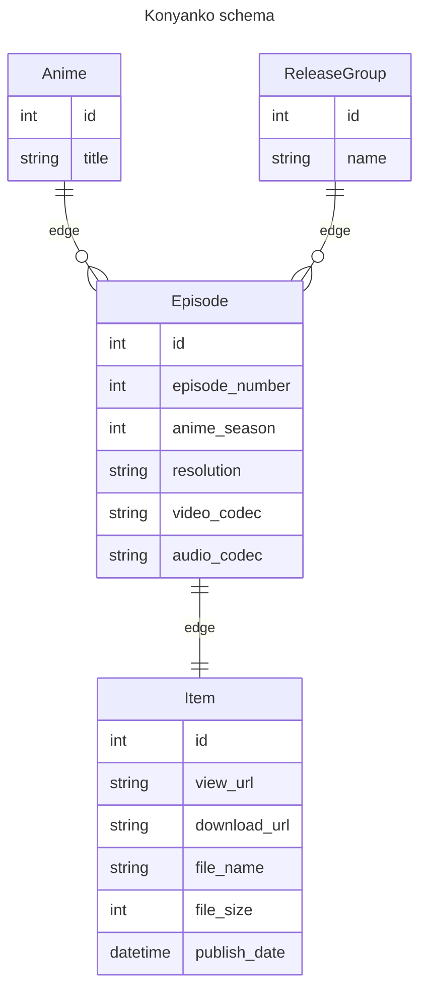

# Konyanko

A nyaa.si aggregator.

## Roadmap

- [x] Schema with entgo
- [x] RSS reader-exporter
- [x] Anime name parser
- [x] Iterative cycles of two above till completed
- [x] Openapi specs from ent schema
- [ ] Server in go and client in js from openapi specs
- [ ] API server
- [ ] Vue UI
- [ ] Crontab RSS puller in server
- [ ] Docker
- [ ] Goreleaser
- [ ] Myanimelist integration

## Schema



## OpenAPI specs

[openapi.json](https://petstore.swagger.io/?url=https://github.com/eiri/konyanko/blob/main/ent/openapi.json)

## Dev runflow

```bash
$ make generate
$ make migrate
$ make import
$ make describe
```
