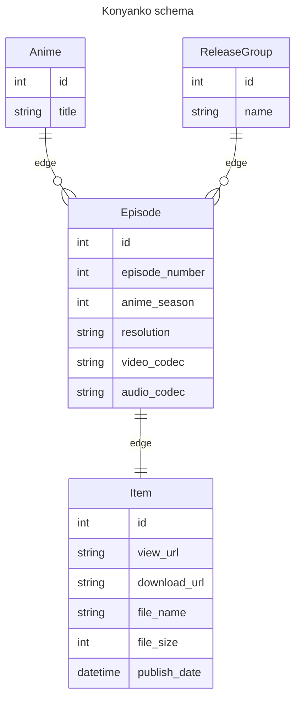

# Konyanko

A nyaa.si aggregator.

## Roadmap

- [x] Schema with entgo
- [x] RSS reader-exporter
- [x] Anime name parser
- [x] Iterative cycles of two above till completed
- [x] ~OpenAPI specs from ent schema~
- [x] GraphQL schema
- [x] API server
- [ ] Vue UI
- [ ] ~Templ + htmx UI~
- [ ] Crontab RSS puller on server
- [ ] Goreleaser
- [ ] Docker

## Maybe later

- [ ] Myanimelist integration
- [ ] Terminal UI

## Schema



## GraphQL specs

[GraphQL schema](https://github.com/eiri/konyanko/blob/main/konyanko.graphql)

## Dev runflow

```bash
$ make generate
$ make migrate
$ make import
$ make describe
```

## Lessons learned

- It feels like `ent` doesn't really want to be ORM, but rather be a graph API.
- Generating REST with `ogent` OpenAPI isn't horrible, but resulting API is not really flexible and writing custom end-points is quite a hustle.
- HTMX + `templ` is interesting combination as an option, but it has all the negatives of REST without positive of `ogent`'s auto-gen. Plus the workflow of "shut down server, regen templ, compile modules, start server" for anything, including tiny tweaks on css is really, really annoying.
